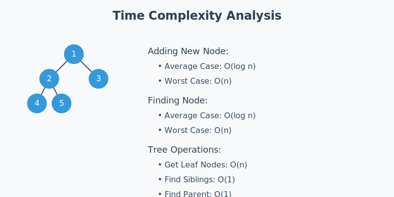

# Binary Tree Implementation


A C implementation of a binary tree with various traversal and search operations. This program builds a binary tree from an array of 20 distinct integers and provides multiple operations to analyze the tree structure.

## Project Structure
```
.
├── include/
│   └── binary_tree.h     # Header with structure and function declarations
├── src/
│   ├── binary_tree/
│   │   ├── main.c       # Main program
│   │   └── binary_tree.c # Implementation
│   └── tests/
│       └── test_binary_tree.c  # Test suite
└── Makefile
```

## Features
1. Build binary tree from array
2. Return root node
3. Find all leaf nodes
4. Find siblings of a node
5. Find parent of a node
6. Find grandchildren of a node

## Algorithm Analysis



### Time Complexity Breakdown

1. **Adding a New Node**
   ```
   Time Complexity: O(log n) average case, O(n) worst case
   
   Why O(log n)?
   - Need to traverse down tree to insert
   - Each level halves the search space
   - Height of balanced tree is log n
   ```

2. **Finding Nodes**
   ```
   Leaf Nodes: O(n)
   - Must visit every node once
   
   Siblings/Parent: O(1)
   - Direct access via parent pointer
   ```

## Build and Run

### Compilation
```bash
make all              # Build everything
make binary_tree     # Build only main program
make test_binary     # Build tests
```

### Run Program
```bash
./build/binary_tree
```

### Run Tests
```bash
./build/test_binary
```

## Implementation Details

### Node Structure
```c
typedef struct Node {
    int data;
    struct Node* left;
    struct Node* right;
    struct Node* parent;
} Node;
```

### Key Functions
1. `buildTree`: Creates tree from array
2. `getLeafNodes`: Returns all leaf nodes
3. `getSibling`: Returns sibling of a node
4. `getGrandchildren`: Returns grandchildren
5. `findNode`: Locates specific node

## Sample Usage
```
Binary Tree Operations
=====================
1. Display Tree
2. Get Root Node
3. Get Leaf Nodes
4. Find Siblings of a Node
5. Find Parent of a Node
6. Find Grandchildren of a Node
7. Exit

Enter your choice: 1

Tree Structure:
        85
    45      90
  25  35  75  95
20  30  40  80  99
```

## Testing
Test cases cover:
1. Node creation
2. Tree building
3. Node finding
4. Leaf node identification
5. Sibling relationships
6. Grandchildren access

## Error Handling
- Memory allocation validation
- Input validation
- Node existence checks
- Boundary checks for array access
